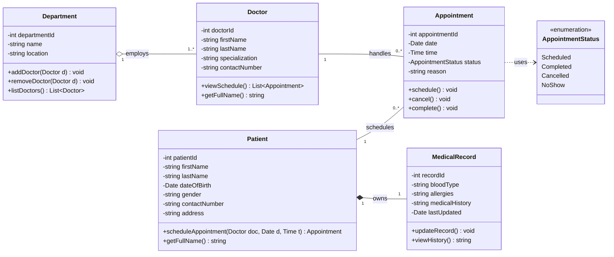

# Clinic Appointment System

**UML Class Diagram & Domain Model — Tagum City Community Clinic**

A design activity modelling a clinic appointment system: patients, doctors,
appointments, departments, and medical records.

---

## The class diagram



> GitHub renders the diagram above automatically. A hand-drawn SVG version is
> in [`diagrams/class-diagram.svg`](diagrams/class-diagram.svg).

---

## Relationships at a glance

| Relationship | Type | Multiplicity | Rules |
|---|---|---|---|
| Patient — Appointment | Association | `1` → `0..*` | 1, 2 |
| Doctor — Appointment | Association | `1` → `0..*` | 3, 4 |
| Department ◇— Doctor | **Aggregation** | `1` → `1..*` | 5, 6, **11** |
| Patient ◆— MedicalRecord | **Composition** | `1` → `1` | 7, 8, **9** |

### Why composition here and aggregation there

Rules 9 and 11 are the graded part of this activity. They use deliberately
opposite language:

| | MedicalRecord (Rule 9) | Doctor (Rule 11) |
|---|---|---|
| Rule says | "does **not** exist independently" | "operate **independently**" |
| Delete the whole → | Part is **destroyed** | Part **survives**, reassigned |
| UML | ◆ filled diamond — **composition** | ◇ hollow diamond — **aggregation** |
| SQL | `ON DELETE CASCADE` | `ON DELETE SET NULL` |
| C# | `internal` ctor, created by owner | `public` ctor, passed in |

Both are 1-to-many shapes. **Only the semantics differ** — and the rules tell
you which is which.

---

## Repository layout

```
ClinicAppointmentSystem/
├── README.md
├── .gitignore
├── docs/
│   ├── 01-analysis.md          Full design rationale & noun analysis
│   └── 02-github-setup.md      Git + GitHub walkthrough
├── diagrams/
│   ├── class-diagram.svg       Rendered diagram (open in a browser)
│   ├── class-diagram.puml      PlantUML source (editable)
│   └── class-diagram.mmd       Mermaid source (editable)
├── src/
│   └── ClinicAppointmentSystem.Domain/
│       ├── Entities/           Patient, Doctor, Appointment, Department, MedicalRecord
│       └── Enums/              AppointmentStatus
└── database/
    ├── schema.sql              MySQL schema
    ├── seed-data.sql           Sample Tagum City data
    └── verify-relationships.sql  Proves composition ≠ aggregation
```

---

## Running things

### The C# domain model

```bash
cd src/ClinicAppointmentSystem.Domain
dotnet build
```

Targets **.NET 8**. It's a class library — the domain model only, no UI.
Open the `.csproj` directly in Visual Studio 2022, or add it to a solution
alongside a WinForms project.

### The database

```bash
mysql -u root -p < database/schema.sql
mysql -u root -p < database/seed-data.sql
mysql -u root -p < database/verify-relationships.sql   # optional proof
```

`verify-relationships.sql` deletes a patient and a department, shows that the
medical record vanished while the doctors survived, then rolls everything back.

---

## Design decisions worth defending

1. **Specialization is an attribute, not a class.** No business rule gives it
   attributes or relationships of its own. Making it a class would be
   over-modelling.

2. **`Department 1..* Doctor`, not `0..*`.** A department with no doctors isn't
   meaningful here. `0..*` is defensible if you want to allow newly created
   empty departments — just be ready to justify your choice.

3. **`status` is an enumeration.** Rule 10 requires a status. An enum makes
   invalid states unrepresentable, unlike a free-text string.

4. **No foreign-key attributes in the classes.** You won't find
   `patientId : int` inside `Appointment`. In UML the association *line*
   expresses that. Foreign keys belong in the database schema.

5. **Both appointment ends are associations.** An appointment has independent
   identity and lifecycle — scheduled, completed, cancelled — so neither the
   patient nor the doctor composes it.

---

## Note on "UMLA"

The activity sheet says *"UMLA class diagram"*. There's no standard by that
name — it's a typo for **UML** (Unified Modeling Language). This deliverable is
a UML Class Diagram. Worth a quiet check with your instructor.

---

## Tools

- **Visual Studio 2022** — .NET 8, C# 12
- **MySQL 8.0** / MySQL Workbench
- **PlantUML** — paste `.puml` at [plantuml.com](https://www.plantuml.com/plantuml)
- **Mermaid** — `.mmd` renders natively on GitHub
